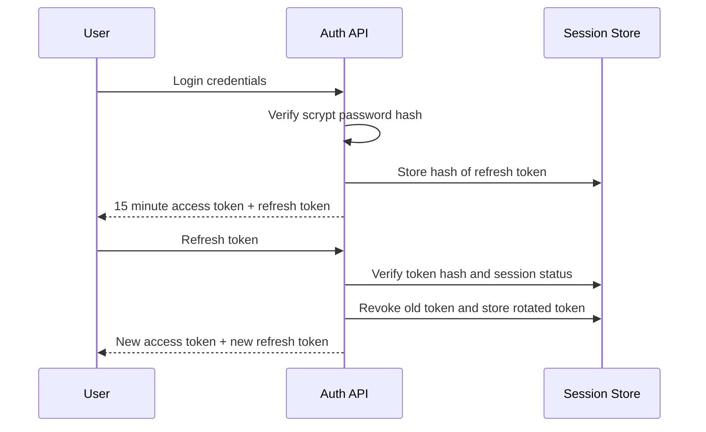

# Secure Authentication & Access Control Service

A defensive application security project focused on authentication, session security, token lifecycle management, and authorization.

## Security features

- Password hashing with Node.js `scrypt` and per-user random salts
- Short-lived JWT access tokens
- Cryptographically random refresh tokens
- Refresh-token hashing before server-side storage
- Refresh-token rotation on every refresh
- Server-side revocation on logout
- Role-based access control for protected routes
- Login rate limiting
- Helmet security headers
- Strict JSON request limits
- Generic authentication failures to reduce account enumeration
- No committed credentials or environment secrets
- Automated authentication and authorization tests

## Token flow



## Run locally

```bash
npm install
cp .env.example .env
npm test
npm start
```

Set a strong `JWT_SECRET` in your local environment. The repository contains only a placeholder example.

## Endpoints

| Method | Endpoint | Purpose |
| --- | --- | --- |
| POST | `/auth/register` | Create demo account |
| POST | `/auth/login` | Authenticate and issue tokens |
| POST | `/auth/refresh` | Rotate refresh token and issue new access token |
| POST | `/auth/logout` | Revoke refresh session |
| GET | `/me` | Authenticated user profile |
| GET | `/admin/metrics` | RBAC-protected admin route |
| GET | `/health` | Health check |

## Application security concepts

This repository demonstrates controls related to:

- broken access control
- authentication failures
- session management
- password storage
- token revocation
- least privilege
- brute-force resistance
- secure defaults
- audit-friendly session state

## Production notes

The in-memory user and session stores keep the project simple and reviewable. A production system should use a durable database, centralized secret management, HTTPS, key rotation, structured audit logging, account recovery controls, email verification, MFA where appropriate, and a distributed rate-limit/session store.
